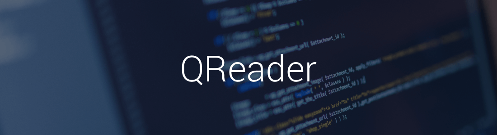

<div align="center">
  
</div>
<h1 align="center"><a href="https://twitter.com/intent/tweet?text=Checkout%20QREader%3A%20Android%20lib%20with%20simplified%20and%20instant%20QR%20code%20reading%20capabilities%F0%9F%98%8E&url=https://github.com/nisrulz/qreader&via=nisrulz&hashtags=AndroidDev">
        
    </a></h1>

<div align="center">
  <strong>Android library which makes use of Google's Mobile Vision API to enable reading QR Code.</strong>
  <p>The library is built for simplicity and ease of use. It not only eliminates most boilerplate code for dealing with setting up QR Code reading , but also provides an easy and simple API to retrieve information from QR Code quickly.</p>
</div>
<br/>
<div align="center">
    <!-- Bintray -->
    <a href="https://bintray.com/nisrulz/maven/com.github.nisrulz%3Aqreader/_latestVersion">
        
    </a>
    <!-- API -->
    <a href="https://android-arsenal.com/api?level=14">
        
    </a>
    <!-- Android Arsenal -->
    <a href="https://android-arsenal.com/details/1/3478">
        
    </a>
     <!-- Android Dev Digest -->
    <a href="https://www.androiddevdigest.com/digest-121/">
        
    </a>
    <!-- GitHub stars -->
    <a href="https://github.com/nisrulz/qreader">
        
    </a>
    <!-- GitHub forks -->
    <a href="https://github.com/nisrulz/qreader/fork">
        
    </a>
    <!-- GitHub watchers -->
    <a href="https://github.com/nisrulz/qreader">
        
    </a>
    <!-- Say Thanks! -->
    <a href="https://saythanks.io/to/nisrulz">
        
    </a>
    <a href="https://www.paypal.me/nisrulz/5">
        
    </a>
    <br/>
     <!-- GitHub followers -->
    <a href="https://github.com/nisrulz/qreader">
        
    </a>
    <!-- Twitter Follow -->
    <a href="https://twitter.com/nisrulz">
        
    </a>
</div>

<div align="center">
  <sub>Built with ❤︎ by
  <a href="https://twitter.com/nisrulz">Nishant Srivastava</a> and
  <a href="https://github.com/nisrulz/qreader/graphs/contributors">
    contributors
  </a>
</div>
<br/>
<br/>


# Changelog
Starting with `1.0.4`, Changes exist in the [releases tab](https://github.com/nisrulz/qreader/releases).

# Integration
QREader is available in the Jcenter, so getting it as simple as adding it as a dependency

- For gradle version < 4.0

    ```gradle
    compile 'com.github.nisrulz:qreader:{latest version}'
    ```

- For gradle 4.0+

    ```gradle
    implementation 'com.github.nisrulz:qreader:{latest version}'
    ```

where `{latest version}` corresponds to published version in [  ](https://bintray.com/nisrulz/maven/com.github.nisrulz%3Aqreader/_latestVersion)

> Requires Google Play Services i.e it works on devices which have Google Play Store installed


# Usage Docs

### Steps

1. Add a `SurfaceView` to your layout

    ```xml
    <SurfaceView
      android:id="@+id/camera_view"
      android:layout_width="match_parent"
      android:layout_height="match_parent"
      />
    ```

1. Setup `SurfaceView` and `QREader` in `onCreate()`

    ```java
    // QREader
    private SurfaceView mySurfaceView;
    private QREader qrEader;
    ..

    @Override
    protected void onCreate(final Bundle savedInstanceState) {
      super.onCreate(savedInstanceState);
      setContentView(R.layout.activity_main);
      ..
      ..

      // Setup SurfaceView
      // -----------------
      mySurfaceView = (SurfaceView) findViewById(R.id.camera_view);

      // Init QREader
      // ------------
      qrEader = new QREader.Builder(this, mySurfaceView, new QRDataListener() {
            @Override
            public void onDetected(final String data) {
                Log.d("QREader", "Value : " + data);
            }

            @Override
            public void onReadQrError(final Exception exception) {
                Toast.makeText(MainActivity.this, "Cannot open camera", Toast.LENGTH_LONG).show();
            }
        }).facing(QREader.BACK_CAM)
                .enableAutofocus(true)
                .height(mySurfaceView.getHeight())
                .width(mySurfaceView.getWidth())
                .build();

    }
    ```

1. Initialize and Start in `onResume()`

    ```java
      @Override
      protected void onResume() {
        super.onResume();

        // Init and Start with SurfaceView
        // -------------------------------
        qrEader.initAndStart(mySurfaceView);
      }
    ```
1. Cleanup in `onPause()`

    ```java
      @Override
      protected void onPause() {
        super.onPause();

        // Cleanup in onPause()
        // --------------------
        qrEader.releaseAndCleanup();
      }
    ```
#### Some provided utility functions which you can use
+ To check if the camera is running

    ```java
    boolean isCameraRunning = qrEader.isCameraRunning()
    ```

+ To stop `QREader`

    ```java
    qrEader.stop();
    ```
+ To start `QREader`

    ```java
    qrEader.start();
    ```
> ##### Check the included sample app for a working example.

# Pull Requests
I welcome and encourage all pull requests. It usually will take me within 24-48 hours to respond to any issue or request. Here are some basic rules to follow to ensure timely addition of your request:
  1. Match coding style (braces, spacing, etc.) This is best achieved using CMD+Option+L (Reformat code) on Mac (not sure for Windows) with Android Studio defaults. The code style used in this project is from [Grandcentrix](https://github.com/grandcentrix/AndroidCodeStyle), so please use the same when editing this project.
  2. If its a feature, bugfix, or anything please only change code to what you specify.
  3. Please keep PR titles easy to read and descriptive of changes, this will make them easier to merge :)
  4. Pull requests _must_ be made against `develop` branch. Any other branch (unless specified by the maintainers) will get rejected.
  5. Check for existing [issues](https://github.com/nisrulz/qreader/issues) first, before filing an issue.  
  6. Have fun!

## Author & support
This project was created by [Nishant Srivastava](https://github.com/nisrulz/nisrulz.github.io#nishant-srivastava) but hopefully developed and maintained by many others. See the [the list of contributors here](https://github.com/nisrulz/qreader/graphs/contributors).

> If you appreciate my work, consider buying me a cup of :coffee: to keep me recharged :metal:
>  + [PayPal](https://www.paypal.me/nisrulz/5)
>  + Bitcoin Address: 13PjuJcfVW2Ad81fawqwLtku4bZLv1AxCL
>
> I love using my work and I'm available for contract work. Freelancing helps to maintain and keep [my open source projects](https://github.com/nisrulz/) up to date!


